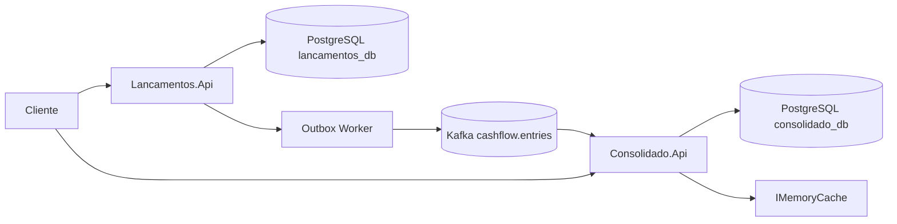

# Arquitetura — Fluxo de Caixa

## Contexto

Solução para controle de fluxo de caixa diário de um comerciante, com registro de lançamentos (débitos/créditos) e consulta de saldo consolidado por dia.

## Domínios e capacidades

| Bounded Context | Capacidade de negócio | Responsabilidade |
|-----------------|----------------------|------------------|
| **Lancamentos** | Registrar movimentação financeira | Persistir créditos/débitos, validar regras, publicar eventos |
| **Consolidado** | Materializar saldo diário | Consumir eventos, projetar saldo, servir consultas |

## Diagrama

## Decisões arquiteturais

| Decisão | Escolha | Justificativa |
|---------|---------|---------------|
| Estilo | Microsserviços (2 serviços) | Isolamento de escrita vs leitura, resiliência |
| Integração | Transactional Outbox + Kafka | Lançamentos não depende do consolidado estar online |
| Persistência | PostgreSQL (database-per-service) | Consistência ACID, padrão corporativo |
| API | .NET 9 Minimal API | Leve, produtivo, alinhado ao ecossistema .NET |
| Projeção | Idempotente por EventId | At-least-once delivery do Kafka |
| Leitura | Cache em memória + rate limiting | Atender pico de 50 req/s no consolidado |

## Stack

- .NET 9, EF Core, Npgsql
- Apache Kafka (Confluent.Kafka)
- Serilog, Docker Compose
- xUnit (testes)

## Evolução

- Schema Registry (Avro) para contratos de evento
- Redis distribuído para cache
- OpenTelemetry + Azure Monitor
- Autenticação JWT via Entra ID
